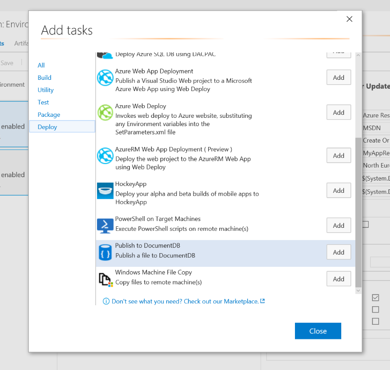
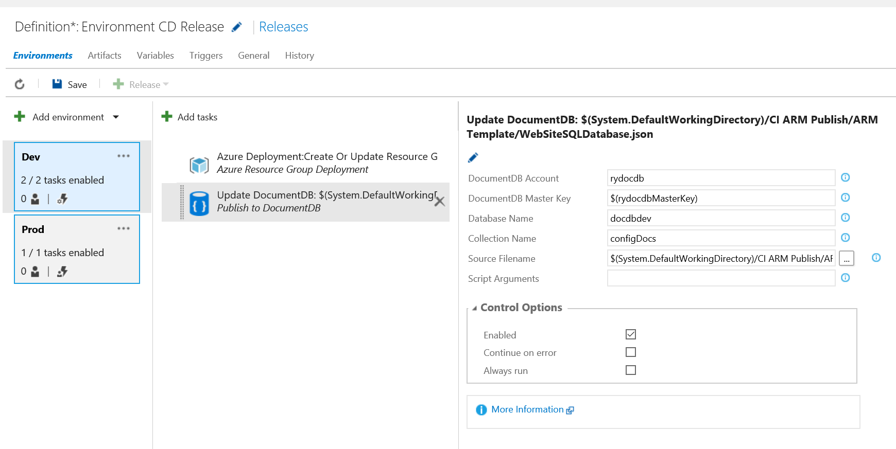

#Create or update DocumentDB documents as part of your Release
Use VSTS's release management to deploy JSON reference or configuration documents to your Azure DocumentDB database collections. 
Currently the following features are available:
* Update/Create Document. Overwrites an existing document.

This extension installs the following components
* Publish Document to DocumentDB task - A Build/Release task to deploy documents. [Learn more](https://russellyoung.net)

##Usage
The deployment tasks use Powershell to invoke REST-API calls to DocumentDB.  No additional dependencies are required.

###Using Publish Document to DocumentDB task to deploy JSON Files
1. Open your build or release definition and add the Publish Document to DocumentDB task. The task can be found in the **Deploy** section of the **Add Tasks** dialog.

 
2. Fill-in the task parameters as described below:

*Note - it is recommended to use variables defined in your Release Environment to store secrets such as the Master Account Key, rather than entering them in plain text in the task parameters dialog.  Secrets in the Environment variables dialog can be secured using the padlock button* 

##Compatibility
Runs on Windows agents (Requires PowerShell3)

##Contact Information
For further information, resolving issues or giving feedback [send mail](mailto:russell@russellyoung.net?Subject=[Feedback]DocumentDB Extension).

